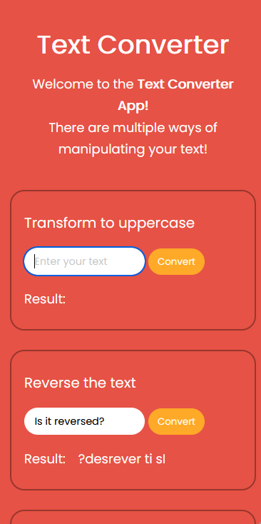
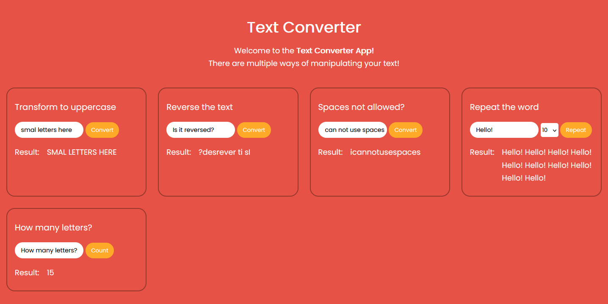

# Text Converter App
Live view: https://martin-kristensen-wd.github.io/Text-converter/

## Screenshot

## Built with

- HTML
- CSS 
- JavaScript

## What I learned

### Learned about DOM manipulation on Input fields.  

**Code Example:** 
<pre><code>
// Repeat word
const repeatInput = document.querySelector('#repeat');
const selected = document.querySelector('#selected');
const repeatResult = document.querySelector('#repeat-result');
const repeatSubmit = document.querySelector('#repeat-sentence');

function repeat() {
   let sentence = repeatInput.value;
   let numberOfTimes = selected.value;
   const wordArray = [];
   for (let i = 1; i <= numberOfTimes; i++) {
      wordArray.push(sentence);
   }
   return repeatResult.innerHTML = wordArray.join(' ');
}
</code></pre>

### Learned about string split() & join() methods.  

**Code Example:** 
<pre><code>
 function reverseText() {
   let forward = reverseInput.value;
   let backward = forward.split("").reverse().join("");
   reverseResult.innerHTML = backward;
}

function removeSpace() {
   let withSpace = spacesInput.value;
   let noSpace = withSpace.split(" ").join("");
   spacesResult.innerHTML = noSpace;
}
</code></pre>

### Useful resources

- [Input DOM manipluation](https://www.w3schools.com/js/js_string_methods.asp)
- [String](https://www.tutorialrepublic.com/faq/how-to-get-the-value-of-text-input-field-using-javascript.php)
